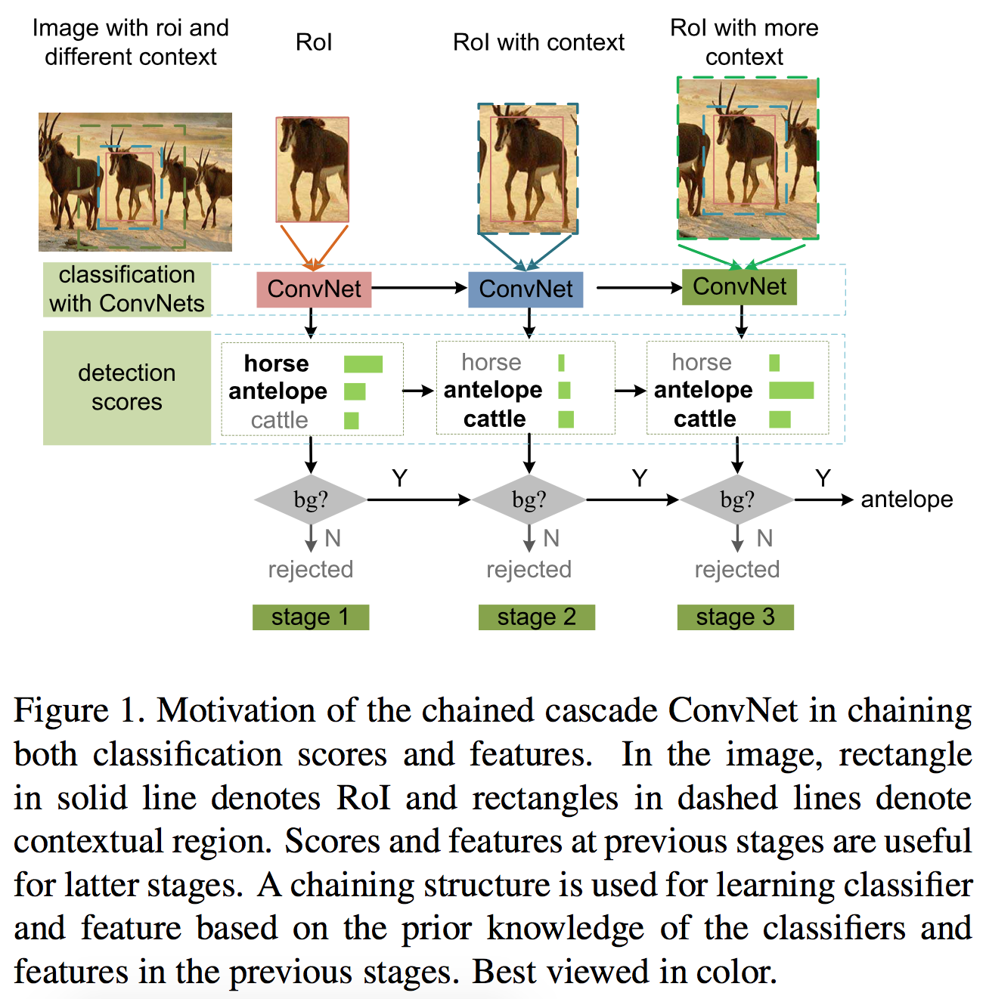

# Chained Cascade Network for Object Detection

by Wanli Ouyang, Kun Wang, Xin Zhu and Xiaogang Wang.

## Introduction

This paper presents chained cascade network (CC-Net). In this CC-Net, the cascaded classifier at a stage is aided by the
classification scores in previous stages. Feature chaining is further proposed so that the feature learning for the current
cascade stage uses the features in previous stages as the prior information. The chained ConvNet features and classifiers of
multiple stages are jointly learned in an end-to-end network. In this way, features and classifiers at latter stages handle
more difficult samples with the help of features and classifiers in previous stages. It yields consistent boost in detection
performance on benchmarks like PASCAL VOC 2007 and ImageNet. Combined with better region proposal, CC-Net leads to state-of-the-art result of 81.1% mAP on PASCAL VOC2007. For more details, please refer to our
[arXiv paper](http://arxiv.org/abs/1702.07054).

## Method

<p align="center">

</p>

### Citation

If you find the code or the models useful, please cite this paper:
```
@article{ouyang2017learning,
  title={Learning Chained Deep Features and Classifiers for Cascade in Object Detection},
  author={Ouyang, Wanli and Wang, Kun and Zhu, Xin and Wang, Xiaogang},
  journal={arXiv preprint arXiv:1702.07054},
  year={2017}
}
```
